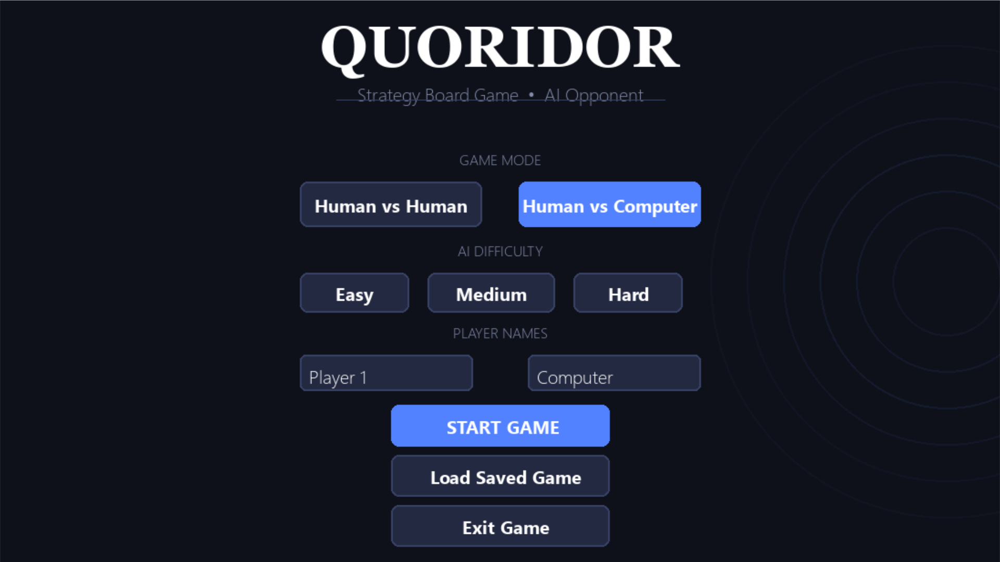
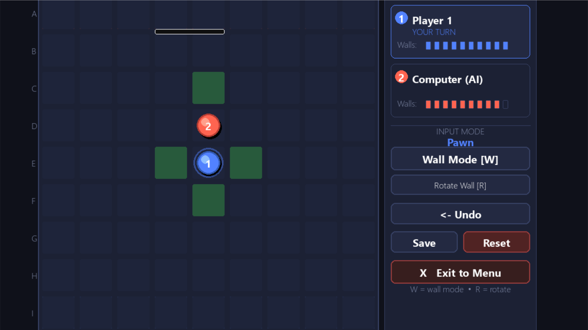
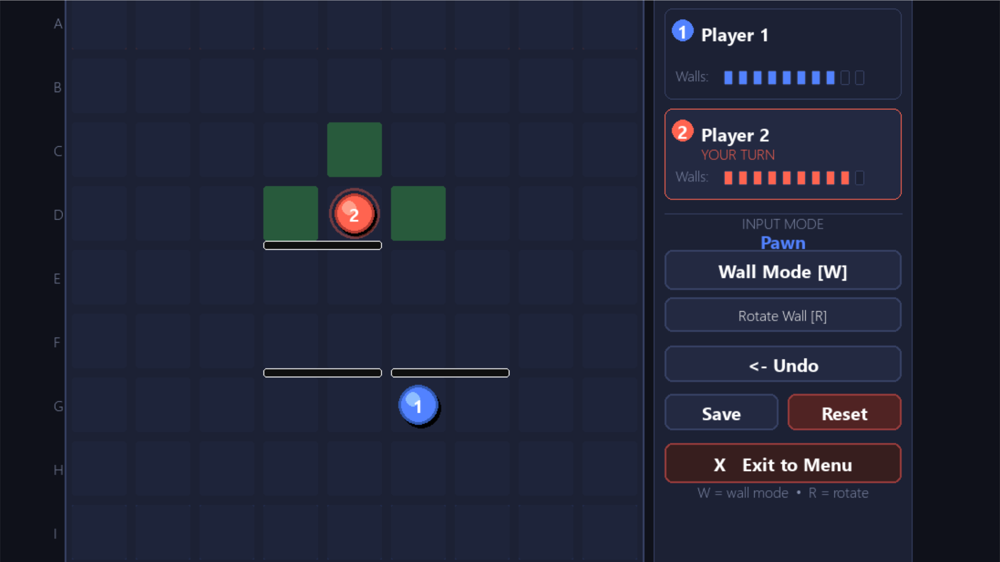
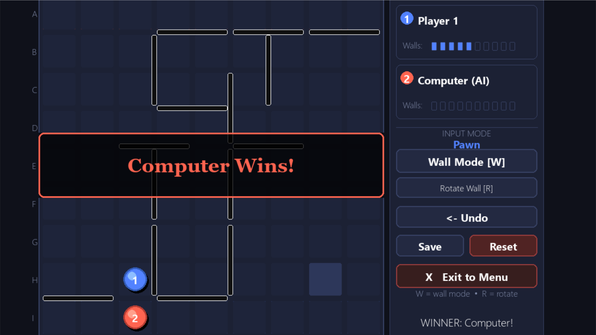
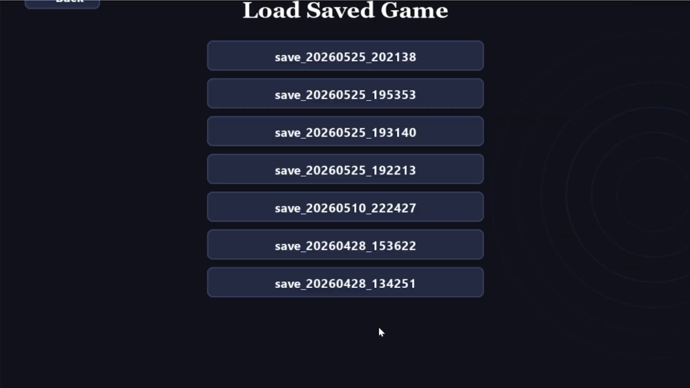

# Quoridor - CSE472s AI Project (Spring 2026)
 Ahmed Abdelghany Mohamed 2300215-Hossam Kamal ElSayed 2300715-Mohamed Khaled Mohamed Kamel 2300478
---

A complete implementation of the Quoridor strategy board game built with Python and Pygame.

---

## Game Description

Quoridor is a 2-player strategy game played on a 9×9 board. Each player moves a pawn from one side to the opposite side. Players can also place walls to block the opponent's path. The first player to reach the opposite side wins.

---

## Screenshots












---

## Installation & Running

### Prerequisites
- Python 3.8+
- pip

### Install dependencies
```bash
pip install pygame-ce
```

### Run the game
```bash
python main.py
```

---

## Controls
| Action | Control / Input |
| :--- | :--- |
| Move pawn | Click a highlighted green cell |
| Toggle wall mode | Press `W` or click "Wall Mode" button |
| Rotate wall orientation | Press `R` or click "Rotate Wall" button |
| Place wall | Click on a wall slot (when in wall mode) |
| Undo last move | Click "Undo" |
| Save game | Click " Save" |
| Reset game | Click " Reset" |
| Exit to menu | Click " Exit to Menu" |

---

## Game Modes

- **Human vs Human** — Two players on the same computer
- **Human vs Computer** — Play against the AI

## AI Difficulty Levels
 Easy: Prioritizes smart pawn movement toward the goal based on shortest-path distances, with a 10% chance to occasionally place a random valid wall.

Medium: BFS-based greedy: advances own pawn, places blocking walls when opponent is close.

Hard: Advanced Minimax with Alpha-Beta pruning and a depth-5 lookahead. It utilizes beam search optimization, strict wall pruning, and anti-backtracking penalties to enforce optimal pathfinding.

---

## Project Structure

```
quoridor/
├── main.py
│   # Initializes the application, creates the game window,
│   # and controls the main execution loop of the game.
├── game_state.py
│   # Handles the core game logic including player positions,
│   # wall placements, turn switching, move validation,
│   # and win condition checking.
├── utils/
│   └── constants.py
│       # Stores global constants used across the project
│       # board dimensions, colors, screen sizes, and AI difficulty settings.
├── ui/
│   ├── board_renderer.py
│   │   # Responsible for rendering the board, players,
│   │   # walls, and visual effects using Pygame.
│   └── components.py
│       # Contains reusable user interface components such as
│       # buttons, text labels, and interactive UI elements.
├── screens/
│   ├── menu.py
│   │   # Implements the main menu interface where players
│   │   # can start the game and choose settings or difficulty.
│   └── game.py
│       # Controls the gameplay screen including event handling
│       # rendering updates, and interaction between the UI and game state.
├── game/
│   ├── __init__.py
│   │   # Marks the directory as a Python package to allow
│   │   # importing modules from the game folder.
│   ├── ai.py
│   │   # Main AI manager that selects the appropriate AI
│   │   # strategy based on the selected difficulty level.
│   ├── algorithms.py
│   │   # Contains shared algorithms such as BFS
│   │   # heuristic evaluation functions, and move analysis utilities.
│   ├── easy_ai.py
│   │   # Implements beginner-level AI behavior using simple
│   │   # heuristics and partially random move selection.
│   ├── medium_ai.py
│   │   # Implements medium difficulty AI using tactical evaluation,
│   │   # board analysis, and strategic move selection.
│   └── hard_ai.py
│       # Implements advanced AI behavior with optimized evaluation,
│       # stronger decision making, and improved strategic planning.
└── saves/
    # Directory used to store saved games, serialized game states,
```

---

## Demo Video
https://drive.google.com/drive/u/0/folders/1QVhPuOueMzCF4yx0Vz584iW9hv6B3CAQ

---


